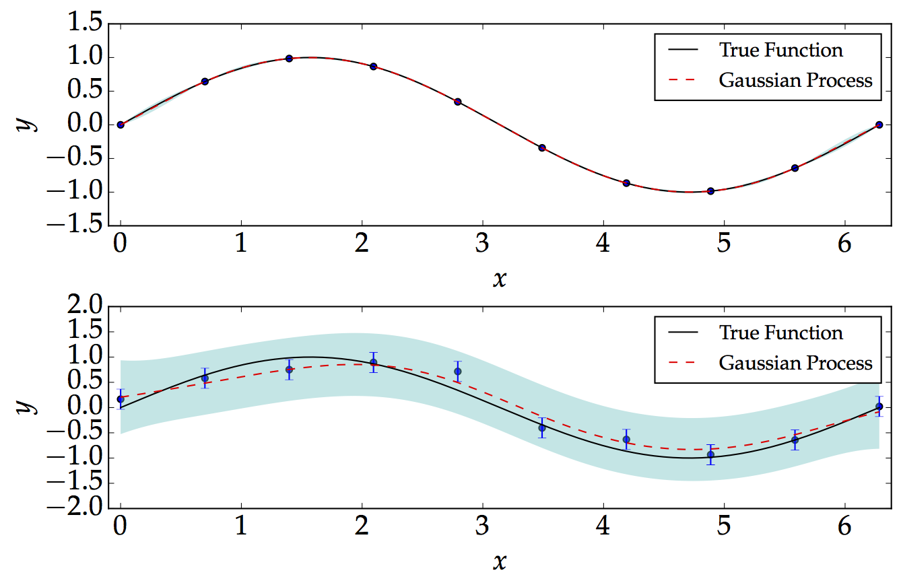
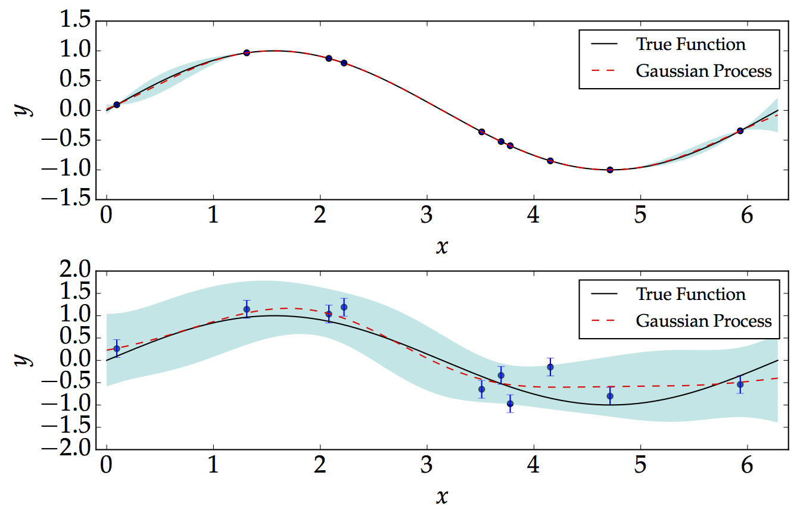

# Gaussian Process

<section>
    
In the most simple term, one can think of Gaussian Process as being distributions over functions. It is a supervised Machine Learning technique and was developed, in the attempt, to solve regression problems. The cool thing about Gaussian Process is that we don't need a "parametric model" to fit the data. It learns using the kernel trick. For an introduction to these techniques, I would recommend the nice review by Prof Zoubin Ghahramani on <a href="http://www.nature.com/nature/journal/v521/n7553/full/nature14541.html">Probabilistic Machine Learning and Artificial Intelligence </a>.

## Examples
Below, we consider two examples: noise-free and a noisy. We show how the Gaussian Process performs well in the noise-free and equally-spaced data as shown below. We consider a simple sinusoidal function of the form 

<section>
    
 On the other hand, we generate noisy data, which are not equally-spaced. The point which we are mostly interested in is that the Gaussian Process basically demonstrates the level of confidence when we have or do not have data. As expected, we would be more confident when we have more data, and less confident when we don't have data. 

### Further Implementations

<ul>
  <li> 
Learn parameters of the kernel using the Maximum Likelihood Estimator (MLE) via optimisation (needs to be implemented). At the moment, we have simply fixed the parameters manually. However, the best is to learn these parameters from the data!</li>

  <li>How to ensure that the kernel, matrix is semi-positive definite? Is that a numerical issue?</li>
  <li>Why does the code complains when I have for example, more than 20 data points? Is it hard to compute the inverse of the matrix?</li>
</ul>

The above-mentioned points need to be addressed!